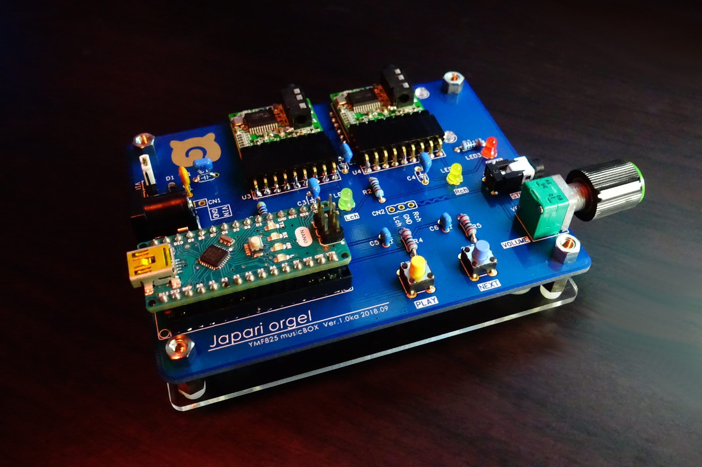
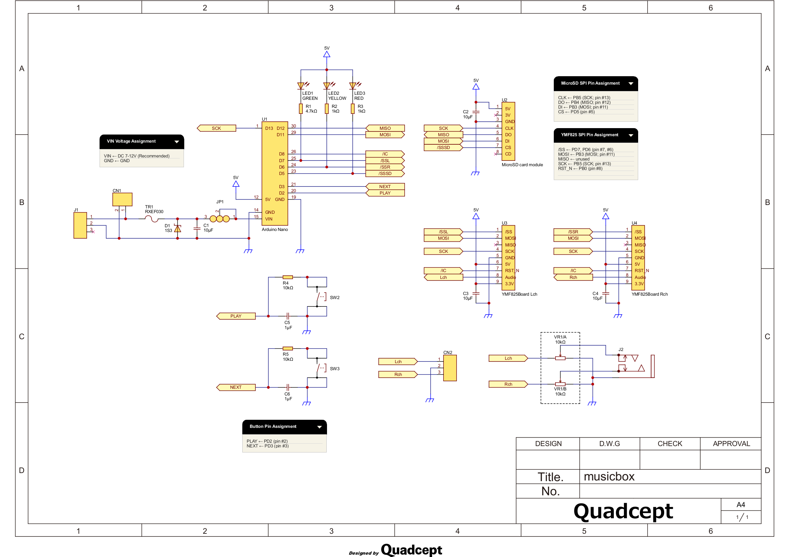
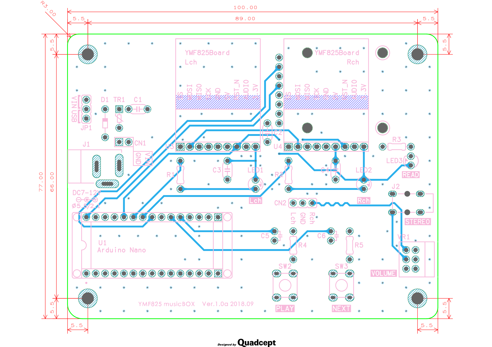
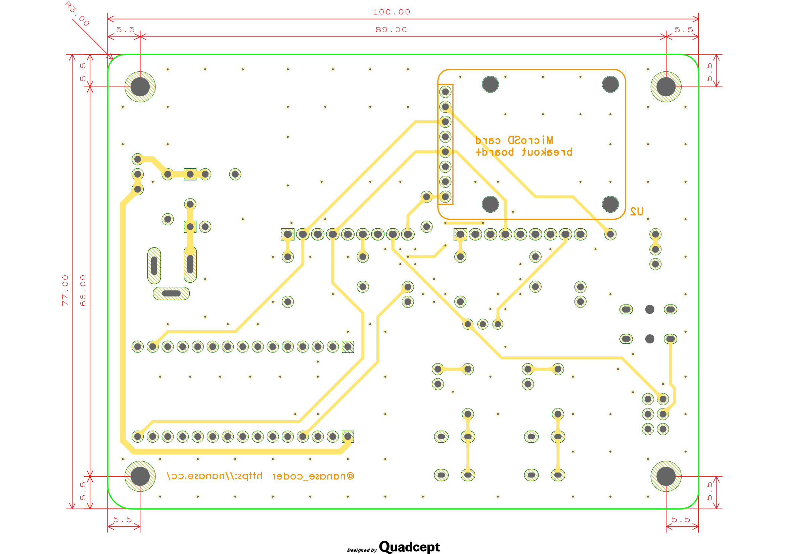
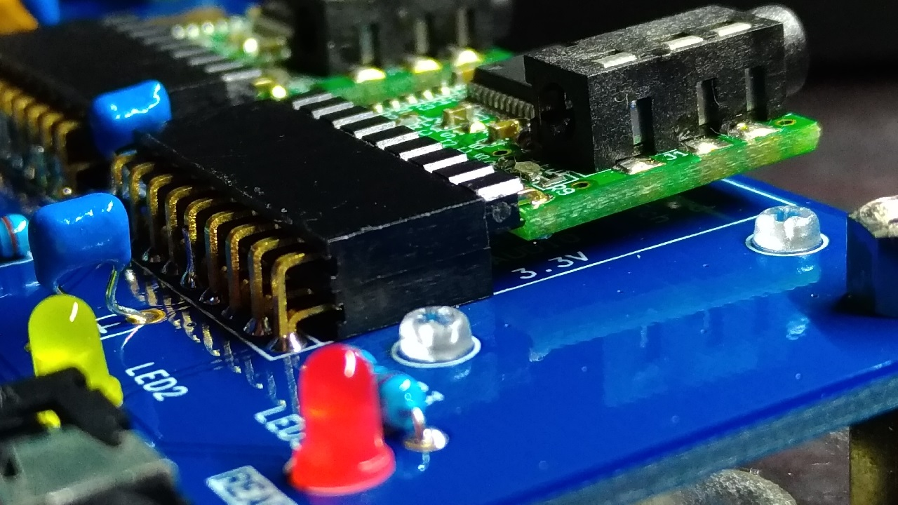

YMF825 musicBOX Ver.1.0a 2018.09
===============================

## エディション

2つの基板エディションがありますが、どちらも同一回路です。

- **Ver.1.0a**: 通常版
- **Ver.1.0ka**: けものフレンズロゴ入り

## 回路図 / PCB

回路図 | Top面 | Bottom面
:------------------------------:|:---------------------------:|:---------------------------------:
 |  | 
[PDF](pdf/schematic.pdf)        | [PDF](pdf/pcb.pdf)          | [PDF](pdf/pcb.pdf)

## 部品表

ref      | 数量 | 名称 | 形式 | 入手先URL
---------|-----|-----|-----|-----
C1 - 4   | 4 | 積層セラミックコンデンサ | 10μF, 5.08mmピッチ | http://akizukidenshi.com/catalog/g/gP-03095/
C5, C6   | 2 | 積層セラミックコンデンサ | 1μF, 2.54mmピッチ | http://akizukidenshi.com/catalog/g/gP-04066/
D1       | 1 | ショットキーダイオード   | 30V 1A | http://akizukidenshi.com/catalog/g/gI-01707/
J1       | 1 | DCジャック      | 外径5.5mm, 内径2.1mm | http://akizukidenshi.com/catalog/g/gC-01604/
J2       | 1 | 小型ステレオミニジャック | 3.5mm | http://akizukidenshi.com/catalog/g/gC-02460/
JP1      | 1 | ピンヘッダ *1   | 1x3 | http://akizukidenshi.com/catalog/g/gC-00167/
JP1      | 1 | ジャンパピン *1 | 2.54mmピッチ | http://akizukidenshi.com/catalog/g/gP-03689/
LED1     | 1 | 青緑色LED *2   | 3mm弾丸型 | http://akizukidenshi.com/catalog/g/gI-12719/
LED2     | 1 | 黄色LED *2     | 3mm弾丸型 | http://akizukidenshi.com/catalog/g/gI-11639/
LED3     | 1 | 赤色LED *2     | 3mm弾丸型 | http://akizukidenshi.com/catalog/g/gI-11577/
R1       | 1 | 金属皮膜抵抗 *2 | 4.7kΩ |
R2       | 1 | 金属皮膜抵抗 *2 | 1kΩ   |
R3       | 1 | 金属皮膜抵抗 *2 | 1kΩ   |
R4, R5   | 2 | 金属皮膜抵抗    | 10kΩ |
SW2, SW3 | 2 | タクトスイッチ *3 | 2.54mmピッチ用 | http://akizukidenshi.com/catalog/g/gP-03650/
TR1      | 1 | ポリスイッチ | 0.3A　0.6A遮断 | http://akizukidenshi.com/catalog/g/gP-00775/
U1       | 1 | Arduino Nano | | http://akizukidenshi.com/catalog/g/gM-09059/
U1       | 1 | ICソケット *4 | 平ピン 32P 600mil |
U2       | 1 | MicroSD card breakout board+ | | https://www.sengoku.co.jp/mod/sgk_cart/detail.php?code=EEHD-4WXB
U2       | 1 | ピンヘッダ *5 | 1x8 | http://akizukidenshi.com/catalog/g/gC-00167/
U2       | 2 | なべ小ねじ+六角ナットセット | M2 | http://akizukidenshi.com/catalog/g/gP-13238/
U2       | 1 | MicroSD カード *6 | |
U3, U4   | 2 | YMF825Board *7 | | http://akizukidenshi.com/catalog/g/gM-12414/
U3, U4   | 2 | ピンヘッダ *8 | オスL型 1x9P | http://akizukidenshi.com/catalog/g/gC-01627/
U3, U4   | 4 | ピンソケット *9 | メスL型 1x9P | http://akizukidenshi.com/catalog/g/gC-01627/
VR1      | 1 | 2連ボリューム | Aカーブ 10kΩ | http://akizukidenshi.com/catalog/g/gP-03604/

### 実装の注意点

- __\*1__ 外部7-12V電源を使用する際は必要です。USBからのみ給電する場合は不要です。
- __\*2__ LEDと電流制限抵抗は任意のものを使用可能です。ただし順方向電流 IF は 最大20mA です。
- __\*3__ タクトスイッチは任意の色を使用可能です。
- __\*4__ ICソケットは 32ピン の片方端の2ピン分を引き抜いて 30ピン としてください。32ピン のままでは取り付けできません。また、丸ピンでは Arduino Nano のピンヘッダが入らないため、**必ず平ピンのICソケットを使用してください**。
- __\*5__ モジュールはんだ付け用のピンヘッダです。基板本体とモジュールを貫通させ、片方をはんだ付けし、プラスチック部分を取り去ってもう片方をはんだ付けしてください。
- __\*6__ 8GB の MicroSDHC カードで動作確認済み。ファイルシステムは **FAT32** でフォーマットしてください。
- __\*7__ YMF825Board は必ず 3.3V 化を施してください。5V のままでは使用できません。
- __\*8__ はんだ付け面を裏面にした場合、U3, U4 のピンソケットは 4つ、表面にした場合は 4つ または 2つ 必要です。また、裏面にはんだ付けした場合は余ったピン部分が基板を傷つけるため、適切な長さに切り取ってください。
- __\*9__ 4つ 使用する場合は下記画像のようにピンソケットを上下に2つ重ね、はんだ付けしてください。

 |
:------------------------------:|
U3, U4 のピンソケットを4つ使った例。YMF825Board のピンヘッダは裏面にはんだ付け |

## 応用
### アクリルパネルについて

秋月電子の [B基板用アクリルパネル](http://akizukidenshi.com/catalog/g/gP-10243/) が適合します。ネジ径は 3M に対応しています。
サンハヤト製 基板保護用アクリル板 ACB-93 とはサイズとネジ穴位置が異なるため**適合しません**。

## 動作上の注意点

1. 外部7-12Vに定格以上 または 定格以下の電圧を絶対に加えないでください。
2. USB給電を使用する際は JP1 のジャンパを USB 側に必ず挿してください。

